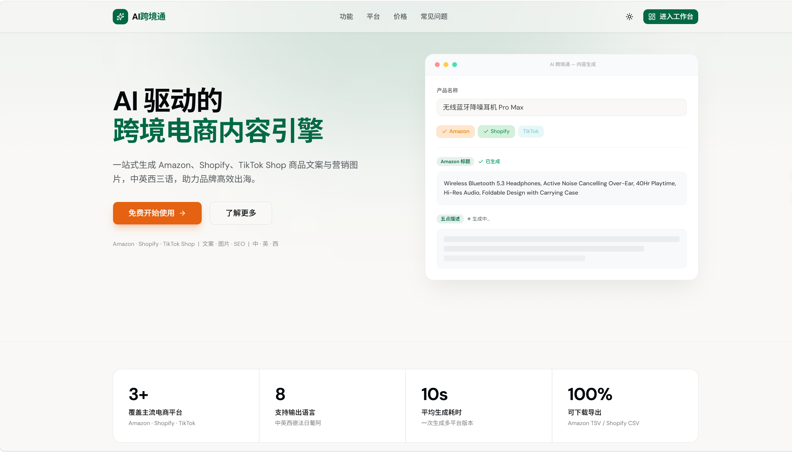
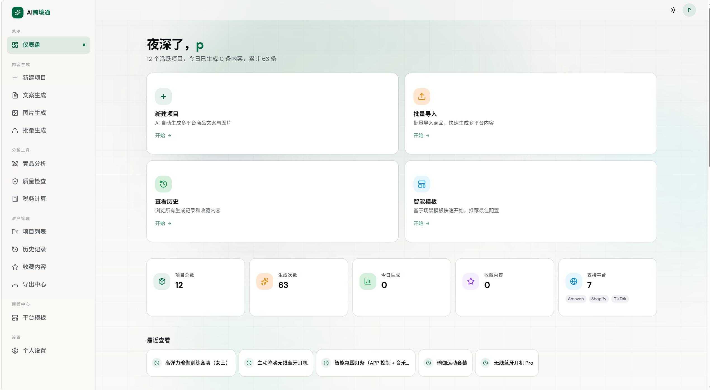

<div align="center">

# AI 跨境通 · AI Cross-border E-commerce Assistant

**一站式 AI 内容引擎，让中国卖家高效出海**

为跨境电商卖家自动生成多平台商品文案与营销内容
覆盖 Amazon · Shopify · TikTok Shop，支持中英西等 8 种语言

[English](#english) · [在线体验 Live Demo](https://ai-cea.com) · [反馈问题](https://github.com/p-j-jx/Nono/issues)

[](https://opensource.org/licenses/MIT)
[](https://nextjs.org/)
[](https://www.typescriptlang.org/)
[](https://tailwindcss.com/)
[](https://vercel.com/)

如果这个项目对你有帮助，欢迎点一个 ⭐ Star 支持！

</div>

---

## ✨ 核心功能

### 🎯 多平台文案生成
针对 Amazon A9 算法、Shopify 品牌站、TikTok 短视频带货分别优化的 AI 文案生成。
一份产品信息，一键产出多平台版本。

### 🖼️ AI 商品图生成
自动生成符合平台调性的商品主图、场景图、Lifestyle 图。

### 🛡️ 规则化质量检查
基于纯规则的 Listing 合规检测：违禁词、长度限制、关键词覆盖、品牌一致性。
**不依赖 AI，结果可解释、可追溯。**

### ⚔️ 竞品分析
关键词差异、标题对比、卖点缺口分析。规则引擎驱动，毫秒级响应。

### 💰 跨境税务计算
覆盖欧盟 VAT、美国销售税、英国 UKCA 等主流市场，AI 智能搜索最新税率。

### 📦 平台格式导出
Amazon Flat File TSV、Shopify CSV、通用 TXT 一键导出。带 BOM 兼容 Excel。

### 📚 项目化管理
以产品为单位组织所有内容、版本、历史记录，方便复用迭代。

---

## 📸 界面预览

> 截图位于 `docs/screenshots/` 目录

| 着陆页 | 工作台 |
|--------|--------|
|  |  |

| 文案生成 | 质量检查 |
|----------|----------|
|  |  |

---

## 🛠️ 技术栈

| 类别 | 技术 |
|------|------|
| **框架** | Next.js 16 (App Router) · React 19 |
| **样式** | Tailwind CSS 4 · shadcn/ui · OKLCH 颜色 |
| **认证** | NextAuth v5 (JWT 策略) |
| **数据库** | Prisma 7 · Turso (libSQL) · SQLite (本地开发) |
| **AI** | DeepSeek · OpenAI (可切换) |
| **部署** | Vercel · Cloudflare CDN |

---

## 🚀 本地启动

### 前置要求

- Node.js 20+
- npm / pnpm / yarn

### 5 步上手

```bash
# 1. 克隆仓库
git clone https://github.com/p-j-jx/Nono.git
cd Nono

# 2. 安装依赖
npm install

# 3. 复制环境变量
cp .env.example .env
# 然后编辑 .env，至少填入 AUTH_SECRET 和 DEEPSEEK_API_KEY

# 4. 初始化数据库
npx prisma generate
npx prisma db push

# 5. 启动开发服务器
npm run dev
```

打开 [http://localhost:3000](http://localhost:3000) 查看效果。

### 必备环境变量

| 变量 | 必填 | 说明 |
|------|------|------|
| `AUTH_SECRET` | ✅ | NextAuth 加密密钥（用 `openssl rand -base64 32` 生成）|
| `AUTH_URL` | ✅ | 本地填 `http://localhost:3000`，生产填实际域名 |
| `DATABASE_URL` | ✅ | 本地 `file:./prisma/dev.db`，生产用 Turso URL |
| `DEEPSEEK_API_KEY` | ⭕ | DeepSeek API Key（[申请](https://platform.deepseek.com)）|
| `OPENAI_API_KEY` | ⭕ | OpenAI API Key（用于图片生成）|
| `TURSO_AUTH_TOKEN` | ⭕ | 仅生产环境（Turso 数据库认证）|

⭕ 表示可选；不填则相关功能不可用，但应用能正常启动。

---

## 📦 部署

### Vercel 一键部署（推荐）

[](https://vercel.com/new/clone?repository-url=https://github.com/p-j-jx/Nono)

1. 点上方按钮 fork 仓库到你的 Vercel 账户
2. 在 Vercel Dashboard → Settings → Environment Variables 中配置必备变量
3. 数据库建议用 [Turso](https://turso.tech)（免费 9GB 流量）
4. 部署完成

### 其他部署方式

- **Docker**：项目根目录运行 `docker-compose up`（即将提供）
- **自托管 VPS**：参考 [部署文档](docs/DEPLOYMENT.md)（即将提供）

---

## 📂 项目结构

```
src/
├── app/                    # Next.js App Router 页面
│   ├── (auth)/             # 登录注册
│   ├── dashboard/          # 工作台主功能
│   │   ├── [id]/           # 项目详情
│   │   ├── competitor/     # 竞品分析
│   │   ├── quality/        # 质量检查
│   │   ├── tax/            # 税务计算
│   │   ├── templates/      # 模板中心
│   │   └── history/        # 历史记录
│   ├── api/                # API 路由
│   └── page.tsx            # 着陆页
├── components/             # React 组件
│   ├── home/               # 着陆页区块
│   ├── dashboard/          # 工作台组件
│   └── ui/                 # shadcn/ui 基础组件
├── lib/                    # 业务逻辑
│   ├── listing-checker.ts  # 质量检查规则引擎
│   ├── competitor-analysis.ts  # 竞品分析引擎
│   └── platform-export.ts  # 平台格式导出
└── proxy.ts                # 中间件（认证守卫）

prisma/
└── schema.prisma           # 数据库 schema
```

---

## 🤝 贡献

欢迎提交 Issue 和 Pull Request！

1. Fork 本仓库
2. 创建特性分支（`git checkout -b feat/your-feature`）
3. 提交改动（`git commit -m 'feat: add some feature'`）
4. 推送到分支（`git push origin feat/your-feature`）
5. 开 Pull Request

提交信息建议遵循 [Conventional Commits](https://www.conventionalcommits.org/zh-hans/) 规范。

---

## 📄 协议

本项目采用 [MIT 协议](LICENSE) 开源。

---

<a id="english"></a>

## English

**AI Cross-border E-commerce Assistant** is an open-source AI content engine that helps Chinese sellers expand overseas efficiently. It generates platform-optimized product listings for Amazon, Shopify, and TikTok Shop in 8 languages.

### Key Features

- 🎯 **Multi-platform content generation** — Amazon A9, Shopify branding, TikTok hooks
- 🖼️ **AI product image generation** — Hero shots, lifestyle scenes
- 🛡️ **Rule-based quality checker** — Banned words, length limits, keyword coverage (no AI needed, fully explainable)
- ⚔️ **Competitor analysis** — Keyword gaps, title comparison, selling point diffs
- 💰 **Tax calculator** — EU VAT, US Sales Tax, UK UKCA with live AI-powered lookup
- 📦 **Platform export** — Amazon TSV, Shopify CSV, generic TXT

### Quick Start

```bash
git clone https://github.com/p-j-jx/Nono.git
cd Nono
npm install
cp .env.example .env  # Fill in AUTH_SECRET and DEEPSEEK_API_KEY at minimum
npx prisma generate && npx prisma db push
npm run dev
```

Visit [http://localhost:3000](http://localhost:3000).

### Tech Stack

Next.js 16 · React 19 · Tailwind CSS 4 · NextAuth v5 · Prisma 7 · Turso · DeepSeek / OpenAI

### License

[MIT](LICENSE)

---

<div align="center">

**如果觉得有用，请给个 ⭐ Star 支持开源！**
**Made with ❤️ for Chinese cross-border sellers**

</div>
